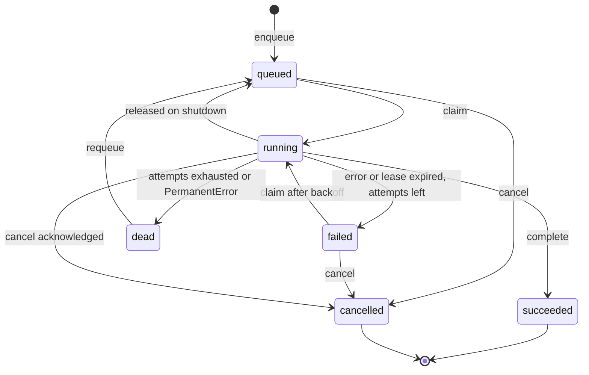

# queueforge

```mermaid
stateDiagram-v2
    [*] --> queued: enqueue
    queued --> running: claim
    queued --> cancelled: cancel
    failed --> running: claim after backoff
    failed --> cancelled: cancel
    running --> succeeded: complete
    running --> failed: error or lease expired, attempts left
    running --> dead: attempts exhausted or PermanentError
    running --> cancelled: cancel acknowledged
    running --> queued: released on shutdown
    dead --> queued: requeue
    succeeded --> [*]
    cancelled --> [*]
```
